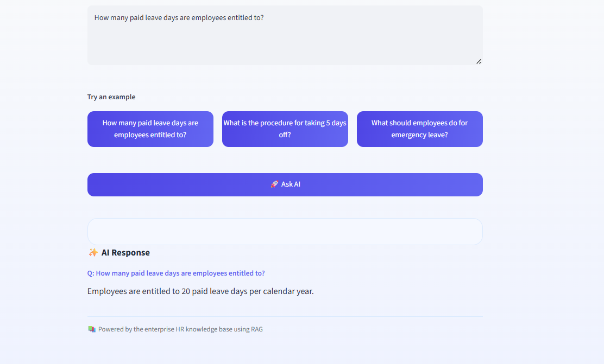
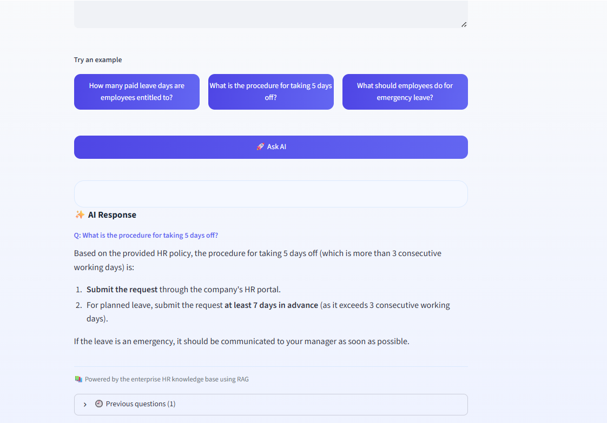

# Enterprise AI Operations Assistant

A small RAG-based HR policy assistant I built to understand how an LLM can answer questions from an internal knowledge base instead of relying only on its general knowledge.

The app takes a user's question, searches the HR policy stored in Pinecone, sends the relevant context to Gemini, and returns the answer through a FastAPI backend and Streamlit UI.

## What it does

- Loads and chunks an HR policy document
- Creates embeddings for the document
- Stores vectors in Pinecone
- Retrieves relevant policy content for a user question
- Uses Gemini to generate a grounded answer
- Exposes the RAG pipeline through FastAPI
- Provides a simple Streamlit web interface
- Returns a safe response when the information is not in the policy

## Architecture

```text
User
  |
  v
Streamlit UI
  |
  v
FastAPI /ask
  |
  v
RAG pipeline
  |
  +--> Gemini Embedding
  |
  +--> Pinecone similarity search
  |
  v
Retrieved HR policy context
  |
  v
Gemini
  |
  v
Final answer
```

## Screenshots

### HR policy question



### Procedure question



## Example

**Question**

> How many paid leave days are employees entitled to?

**Answer**

> Employees are entitled to 20 paid leave days per calendar year.

Another example asks about taking 5 days off, and the assistant uses the policy context to explain the required procedure and advance notice.

## Tech stack

- Python
- Google Gemini
- RAG
- Pinecone
- FastAPI
- Streamlit
- LangChain text splitters

## Project structure

```text
enterprise-ai-operations-agent/
├── app/
│   ├── document_loader.py
│   ├── embeddings.py
│   ├── rag.py
│   ├── retriever.py
│   └── vector_store.py
├── documents/
│   └── hr_policy.txt
├── tests/
├── main.py
├── streamlit_app.py
├── requirements.txt
├── .gitignore
└── README.md
```

## Run locally

Create and activate a virtual environment:

```powershell
python -m venv .venv
.\.venv\Scripts\Activate.ps1
```

Install dependencies:

```powershell
pip install -r requirements.txt
```

Create a `.env` file in the project root:

```text
GEMINI_API_KEY=your_gemini_api_key
PINECONE_API_KEY=your_pinecone_api_key
```

Start the FastAPI backend:

```powershell
uvicorn main:app --reload
```

In a second terminal, start Streamlit:

```powershell
streamlit run streamlit_app.py
```

Then open the Streamlit URL shown in the terminal.

## Why I built it

I wanted hands-on experience building a complete GenAI application rather than only experimenting with individual APIs. This project helped me understand the flow from document ingestion and embeddings to vector retrieval, LLM generation, API integration, and a user-facing interface.
